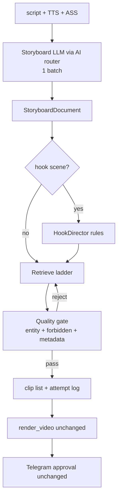

# AI Director V2 Design

> **Durum:** yalnızca analiz + tasarım. Kod yok. Onay bekleniyor.  
> **Bağlam:** Rolex job `20260922-172434` yaratıcı kalite **BAŞARISIZ** (sistem çalıştı, video izlenmedi).  
> **Korunacaklar:** legacy `VISUAL_ENGINE` yolu, Telegram onay, publishers.  
> **Model/provider seçimi:** AI router (`LLM_API_URL`). Director içine ayrı routing eklenmez.

Kaynaklar: `director.py`, `director_planner.py`, `director_types.py`, `stock_media.py`, `subtitles.py`, `pipeline.py`, `audio_bgm.py`, `AI_DIRECTOR_ROLEX_TEST.md`, `AI_Director_plan.md`.

---

## 1. Root causes (özet)

| # | Kök neden | Etki (Rolex) |
|---|-----------|--------------|
| R1 | **Relevance gate kendi query’sini skorluyor** — aday medya metadata’sını değil | Pastane B-roll 1.0 ile “kabul” |
| R2 | **Planner LLM düştü → heuristic** — entity/avoid/must_show boş | Hans Wilsdorf sahnesi düşünülmedi |
| R3 | **Tek yüzeysel query + ilk Pexels hit kabul** | “Rolex hans wilsdorf foundation” → alakasız stok |
| R4 | **Director asset selector**, storyboard değil | Jenerik watchmaker/boardroom baskın |
| R5 | **Hook sahnesi özel değil** | 0–3s zayıf/durağan + üst hook ASS + karaoke çakışması |
| R6 | **Medya çeşitliliği sığ** (video/photo/ai_image) | Mini-belgesel değil stock montaj |
| R7 | **Pacing/audio Director dışında sabit** | Yavaş VO, zayıf dark-luxury bed |
| R8 | **Quality gate “buldum=kullan”** | Alakasız görüntü son fallback bile olmalıydı değil, birinci sınıf red |

---

## 2. Semantic relevance failure — kod üzerinden (pastane / Foundation)

### 2.1 Bu testte ne oldu? (kanıt)

Log / `AI_DIRECTOR_ROLEX_TEST.md` sahne **6**:

| Alan | Değer |
|------|--------|
| Query | `Rolex hans wilsdorf foundation` |
| Provider | **pexels** (`stock_video`) |
| Plan kaynağı | **heuristic** (LLM plan yok: gemma `:free` 400 + gemini-flash 502) |
| Score | **1.0** accepted |
| `must_show` / `avoid` | heuristic’te **hiç set edilmiyor** → `[]` |

Dış analiz: 0:04–0:08 Foundation / ownership anlatılırken **pastane/kurabiye** B-roll.

### 2.2 Gate neden reddetmedi? (`director.py`)

```236:260:video-worker/app/director.py
        blob = f"{query} {topic} {(rel[0].get('query') if rel else '')}"
        score = score_candidate_text(
            blob,
            queries=[query],
            must_show=scene.must_show,
            avoid=scene.avoid,
        )
        # Prefer provider metadata blob when present
        if rel:
            score = max(
                score,
                score_candidate_text(
                    str(rel[0]),
                    queries=[query],
                    ...
                ),
            )
```

- `rel[0]` = `{scene, source, query}` — **Pexels title/tags/url yok**.
- `blob` ≈ `"Rolex hans wilsdorf foundation Rolex Rolex hans wilsdorf foundation"`.
- `_score_stock_candidate(blob, query)` token overlap ≈ **1.0**.
- Eşik `DIRECTOR_RELEVANCE_MIN=0.2` → her zaman geçer.
- **İndirilen videonun içeriği / metadata’sı skorlanmıyor.**

`stock_photo` yolu daha da zayıf: `score_candidate_text(query, queries=[query])` + `max(score, 0.25)` → dosya varsa kabul.

### 2.3 `stock_media` iç skor neden yetmedi?

`_search_portrait_video` URL/user blob skorlar ve `_IRRELEVANT_SLUG_TOKENS` kullanır (`cooking`, `kitchen-food`, …).  
**Eksik:** `bakery`, `cookie`, `pastry`, `cake`, `dessert`, `food`, `bakery-shop` vb. yok.  
“Foundation” aramasında Pexels’in döndürdüğü pastane URL’i bu listeye takılmadan seçilebilir; Director sonra **yeniden skorlamayı bozar** (yukarıdaki self-score).

### 2.4 `must_show` / `avoid` enforce?

| Katman | Durum |
|--------|--------|
| `ScenePlan.must_show` / `avoid` | Alan var |
| Heuristic plan | **Doldurmuyor** |
| LLM plan (bu test) | **Çalışmadı** |
| `score_candidate_text` | avoid substring → -10; must_show hit → +0.15 |
| Pratikte Rolex testinde | **Ölü kod yolu** — boş listeler |

Sonuç: Foundation sahnesinde `avoid=["bakery","cookie","food",…]` ve `must_show=["Rolex","Wilsdorf","Geneva"]` yoktu; olsa bile skorlanan blob aday metadata olmadığı için avoid tetiklenmezdi.

---

## 3. Entity-aware visual direction — değerlendirme

### 3.1 Bugün

- `script_gen` → `concrete_nouns`, `scene_stock_queries`, `visual_prompts`.
- Heuristic bunları query/intent’e kırpar; **entity tipi yok** (brand / person / product / place / org).
- Rolex, Hans Wilsdorf, Submariner, Daytona, Geneva: prompt’ta geçebilir ama **zorunlu entity gate yok**.

### 3.2 V2 veri alanları (gerekli)

Her sahne storyboard kartında:

| Alan | Amaç |
|------|------|
| `primary_entities[]` | Ana marka/kişi/ürün/yer |
| `required_entities[]` | Aday metadata/görüntüde şart (veya AI zorunlu) |
| `forbidden_concepts[]` | food, bakery, gym, beach, generic-crowd… |
| `visual_specificity` | `iconic` \| `literal` \| `adjacent` \| `metaphor` \| `abstract` |
| `entity_hard_fail` | `true` → entity yoksa stock kabul yok |

**Kural:** `visual_specificity ∈ {iconic, literal}` ve entity sahnesinde generic watchmaker/boardroom **kolay kabul edilmez**; exact/adjacent arama + archive/AI tercih.

---

## 4. Search strategy (çok aşamalı ladder)

Tek query yerine sıra (başarısız → sonraki; alakasız asla “son çare kabul” değil):

1. **exact entity** — `Hans Wilsdorf`, `Rolex crown logo`, `Submariner dial`
2. **entity + context** — `Hans Wilsdorf Rolex archive`, `Rolex Geneva headquarters exterior`
3. **conceptual substitute (still on-brand)** — `Swiss watch manufacture Geneva facade`, `Rolex boutique window night`
4. **document / graphic** — foundation ownership chart, share-flow diagram (ücretsiz grafik)
5. **archive_still** (Wikimedia vb.) — lisanslı gerçek materyal
6. **controlled AI image** — entity + dark-wealth style; metadata self-check
7. **controlled AI video** (kota) — yalnız motion_required
8. **HARD FAIL scene** veya güvenli marka-safe still — **bakery/food asla**

Alakasız stok = **red**, ladder’ın basamağı değil.

---

## 5. Visual storyboard director (V2 model)

Director = **storyboard üret (1 LLM batch via AI router) → retrieve with gates → assemble**.  
Asset selector yalnız retrieve katmanı.

### 5.1 `StoryboardScene` (hedef şema)

```text
index, narrative_role          # hook | evidence | entity_proof | twist | cta
visual_intent                  # 1–2 cümle: ne görünmeli
primary_entities[]
required_entities[]
must_show[] / must_not_show[]  # = forbidden_concepts
preferred_media[]              # ordered MediaKind
shot_type                      # hero_closeup | insert | wide | archival | graphic | doc
motion                         # static_kb | slow_push | whip | hold
transition_intent              # cut | xfade_short | match_cut
search_queries[]               # ladder stage 1..n already ordered
fallback_ladder[]              # MediaKind + query stage pairs
confidence                     # planner’ın kendi güveni 0–1
allow_ai_generation            # bool
pacing_hint                    # short|medium|hold (opsiyonel V2.1)
```

### 5.2 `MediaKind` genişletme (legacy silmeden)

`stock_video` | `stock_photo` | `archive_still` | `document_graphic` | `stat_graphic` | `ai_image` | `ai_video`  
(V1’deki üçlü yetmez; archive/graphic V2’de.)

---

## 6. Hook director (0–3s)

Hook **normal sahneden ayrı**:

| Kural | Öneri |
|-------|--------|
| Görsel | Konuya özgü **hero** (`shot_type=hero_closeup`, Rolex crown / dial) |
| Motion | `slow_push` veya hızlı cut; durağan gradient yasak |
| Metin | Kısa hook kartı **veya** karaoke — **ikisi birden üst+alt dolu olmasın** |
| ASS | `hook_seconds` içinde karaoke cue’ları bastır / hook stilini küçült / karaoke’yi geciktir |
| Süre | Hook sahne duration üst sınırı (örn. ≤2.0s) |

Mevcut kod: `pipeline` → `write_ass(..., hook_text=..., hook_seconds=2.5)` + highlight karaoke aynı anda (`subtitles.py`). V2: Director veya pipeline flag `HOOK_OVERLAY_MODE=exclusive|karaoke_delayed`.

---

## 7. Media diversity

Sahne `narrative_role` → varsayılan kind sırası:

| role | Tercih |
|------|--------|
| hook | iconic photo/video → AI hero |
| entity_proof | archive / exact product → AI |
| evidence (para/ownership) | document_graphic / vault literal → AI chart |
| atmosphere | stock ok (sıkı gate) |

Video-only zincir yasak: job meta’da kind diversity check (örn. ≥2 distinct kinds veya fail warning).

---

## 8. Pacing / audio — mimari değerlendirme

### Bugün (kod)

| Parça | Davranış |
|-------|----------|
| TTS | `VIDEO_VOICE_RATE` sabit (`+12%` default) |
| Sahne süreleri | `plan_scene_schedule` ses süresinden; Director etkilemez |
| BGM | `get_or_create_bgm` rastgele / sentetik sine; `bgm_volume=0.15` |
| SFX | `ENABLE_SFX` + geçiş/kelime; dark-luxury mood yok |

### V2 önerisi

- **Ayrı tam audio motoru şart değil** ilk dilimde.
- Director storyboard’a opsiyonel `pacing_plan` (tek JSON, aynı LLM batch veya script_gen sonrası):
  - `narration_rate_hint` (pipeline `VIDEO_VOICE_RATE` override — dikkatli)
  - `scene_duration_bias`
  - `music_mood`: `dark_luxury` | `tense` | `minimal`
  - `sfx_cues[]`
- BGM: mood’a göre klasör seçimi (`bgm/dark_luxury/`) — rastgele tüm havuz değil.
- Bu katman **render/Telegram/publish’i bozmadan** pipeline’da opsiyonel uygulanır.

---

## 9. Quality gate (en kritik)

### 9.1 Aday confidence

Her aday için:

```text
confidence =
  entity_score      # required_entities ∩ metadata (+ opsiyonel caption)
+ topical_score     # query tokens ∩ metadata
- forbidden_penalty # must_not_show / food taxonomy
- generic_penalty   # "luxury lifestyle", "business meeting" yalnız
```

**Kabul:** `confidence >= SCENE_MIN` (entity sahnelerinde daha yüksek, örn. 0.55).  
**Altında:** red → ladder sonraki basamak.  
**Ladder tükenirse:** AI (kotada) veya **sahne hard-fail / job quality_warning** — alakasız stok **yok**.

### 9.2 Zorunlu metadata

Retrieve katmanı Pexels/Pixabay’dan **title, tags, url, id** döndürmeli; gate yalnız query self-score yapamaz.

### 9.3 Food/bakery denylist

`_IRRELEVANT` + Director `forbidden_concepts` birleşik taxonomy: bakery, cookie, pastry, cake, dessert, icing, dough, cafe-food, …

---

## 10. Fallback ladder (özet)

```
exact entity stock
  → entity+context stock
  → on-brand adjacent stock
  → archive / document graphic
  → AI image (entity-locked prompt)
  → AI video (rare)
  → FAIL (no unrelated filler)
```

`director_fill` + `fallback_on_empty=True` ile “herhangi bir klip” doldurma **V2’de kapatılır** (veya yalnız non-entity atmosphere).

---

## 11. Rolex regression test (kalıcı)

**Dosya (ileride):** `tests/test_director_rolex_regression.py` (+ opsiyonel golden fixture).

Senaryo metni (örnek):

> “Hans Wilsdorf Foundation owns every share, funneling billions…”

Fixture adayları:

| Aday metadata blob | Beklenen |
|--------------------|----------|
| title/tags: bakery, cookies, pastry | **REJECT** |
| cooking, kitchen-food | **REJECT** |
| Rolex crown logo, Geneva HQ | **ACCEPT** (yüksek) |
| generic “business meeting handshake” | **REJECT** veya low (entity_hard_fail) |

Asserts:

1. `score(bakery_blob, foundation_scene) < 0` veya `< MIN`
2. `must_not_show` food → hard reject
3. `required_entities` kaçırılırsa accept yok
4. Self-score-on-query yolu testte **yasak** (mock retrieve metadata zorunlu)

Manuel: Rolex job tekrarında 0:04–0:08 food B-roll = fail.

---

## 12. Yeni mimari (V2, flag arkasında)



Modüller (öneri, henüz yazılmadı):

| Modül | Rol |
|-------|-----|
| `director_types.py` | genişletilmiş storyboard şema |
| `director_planner.py` | storyboard LLM; heuristic entity-aware |
| `director_retrieve.py` | ladder + provider adapters |
| `director_gate.py` | confidence / denylist |
| `director_hook.py` | hook overlay kuralları (veya subtitles opsiyon) |
| `director.py` | orkestrasyon |
| `pipeline.py` | yalnız `DIRECTOR_V2` / `DIRECTOR_ENABLED` dalı |

Legacy dal **silinmez**. AI router = tek LLM gateway.

---

## 13. Maliyet etkisi

| Kalem | Etki |
|-------|------|
| Storyboard 1× LLM | +1 çağrı/video (AI router) — V1 ile aynı mertebe |
| Çok aşamalı arama | Daha fazla Pexels/Pixabay (ücretsiz kota) |
| Archive | ücretsiz, latency |
| AI image | yalnız ladder sonlarında; kota korunur |
| AI video | nadir |
| Reject telemetrisi | ucuz |

Öğrenci bütçesi: free-first + sıkı gate → **daha az yanlış stok, bazen daha çok AI** (bilinçli tradeoff). Alakasız stok “ucuz” sayılmaz.

---

## 14. V2 implementasyon sırası (onay sonrası)

1. **Gate fix** — metadata skor; food denylist; self-score kaldır; reject log  
2. **Rolex regression unit tests**  
3. **Storyboard şema + planner prompt** (AI router); heuristic entity fill  
4. **Search ladder** (exact → … → AI); `director_fill` kapat  
5. **Hook overlay kuralı** (ASS çakışması)  
6. **Media kinds:** archive_still + document_graphic (hafif)  
7. **Pacing/BGM mood** (opsiyonel)  
8. **Kontrollü Rolex entegrasyon testi** — yayın yok; Telegram’a kadar  

Her adım: `DIRECTOR_ENABLED` default false; legacy dokunulmaz.

---

## 15. Mevcut kodda sorunlu noktalar (dosya listesi)

| Dosya | Sorun |
|-------|--------|
| `director.py` `_try_kind` | Query self-score; metadata yok; photo floor 0.25 |
| `director_planner.py` `_heuristic_plan` | must_show/avoid/entities boş; entity yok |
| `director_planner.py` `plan_scenes` | LLM fail → sessiz heuristic (üretim “başarılı” görünür) |
| `stock_media.py` `_IRRELEVANT_*` | bakery/cookie/pastry yok |
| `director.py` fill bloğu | `fallback_on_empty=True` alakasız doldurma riski |
| `subtitles.py` + `pipeline.py` | Hook + karaoke eşzamanlı kalabalık |
| `audio_bgm.py` | Mood’suz / sentetik zayıf bed |
| `AI_Director_plan.md` | V1 “çalışan” iddiası kaliteyi kapsamadı |

---

## 16. Onay kapısı

Bu belge **tasarım**. Uygulama yok.

Onay örneği: “V2 sırayla 1–2’den başla (gate + regression)” / “önce storyboard şema” / “hook ASS’i ertele”.

**Beklenen kararlar:**

1. Gate+regression önce mi, full storyboard bir arada mı?  
2. Archive/graphic V2 ilk dilimde mi?  
3. Hook’ta overlay exclusive mi, karaoke delayed mi?  
4. LLM plan zorunlu mu (heuristic ile ship yasak mı)?
